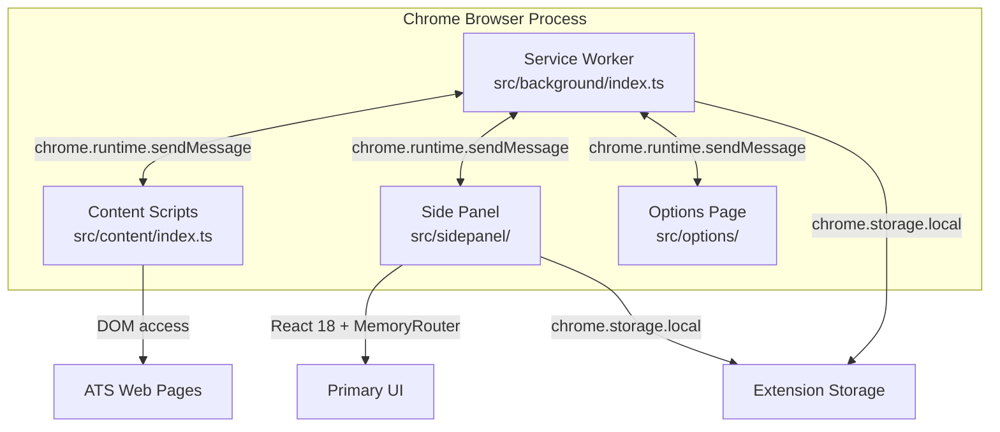
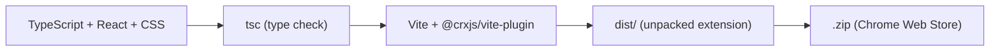

# Design Document: Project Scaffolding & Extension Shell

## Overview

This design establishes the foundational Chrome extension project for AutoApply — a Vite 5 + React 18 + TypeScript (strict) application using Manifest V3. The extension shell provides four execution contexts (service worker, side panel, content scripts, options page) connected via a typed message protocol, with TailwindCSS + shadcn/ui for styling, Zustand for state management, and a Supabase client singleton for future backend integration.

The primary goal is a zero-to-working developer experience: `npm install && npm run dev` yields a hot-reloading Chrome extension with a functional side panel, service worker lifecycle, and content script injection on ATS domains.

### Key Design Decisions

| Decision | Choice | Rationale |
|----------|--------|-----------|
| Vite plugin | `@crxjs/vite-plugin@beta` | Only the beta channel supports Vite 5 + MV3 service workers |
| Side panel routing | `MemoryRouter` | Chrome extension side panels lack History API access; `BrowserRouter` throws |
| Content script CSS isolation | `ShadowRoot` (mode: open) | Prevents bidirectional CSS leakage between FAB and host page |
| Content script CSS loading | Vite `?inline` import suffix | Normal CSS imports inject into `<head>`, defeating Shadow DOM; `?inline` returns raw CSS string for manual `<style>` injection |
| Message types location | `src/types/messages.ts` | Avoids circular deps when `src/utils/messaging.ts` imports types |
| Supabase session storage | `chrome.storage.local` adapter | MV3 service workers are ephemeral; `localStorage` is unavailable |
| State management | Zustand | Works across all extension contexts, minimal boilerplate |

## Architecture

### Extension Context Model



### Build Pipeline



### Project Directory Structure

```
autoapply/
├── public/
│   └── icons/
│       ├── icon-16.png
│       ├── icon-48.png
│       └── icon-128.png
├── src/
│   ├── background/
│   │   └── index.ts              # Service worker entry
│   ├── content/
│   │   ├── index.ts              # Content script entry
│   │   └── content.css           # FAB-scoped styles (imported via ?inline)
│   ├── sidepanel/
│   │   ├── index.html            # Side panel HTML shell
│   │   ├── index.css             # Tailwind directives
│   │   ├── main.tsx              # React entry point
│   │   ├── App.tsx               # Root component + MemoryRouter
│   │   └── components/
│   │       └── ui/
│   │           └── button.tsx    # shadcn/ui Button
│   ├── options/
│   │   ├── index.html
│   │   └── App.tsx
│   ├── lib/
│   │   ├── supabase.ts           # Supabase client singleton
│   │   └── utils.ts              # cn() utility
│   ├── stores/
│   │   └── index.ts              # Zustand app store
│   ├── types/
│   │   ├── messages.ts           # Message protocol types
│   │   └── database.types.ts     # Placeholder Supabase types
│   └── utils/
│       └── messaging.ts          # Typed sendMessage helper
├── manifest.config.ts
├── vite.config.ts
├── tailwind.config.ts
├── postcss.config.js
├── tsconfig.json
├── package.json
└── .env.example
```

## Components and Interfaces

### 1. Build Configuration Layer

**vite.config.ts** — Vite 5 configuration with `@crxjs/vite-plugin` and `@vitejs/plugin-react`. Configures path aliases (`@/` → `src/`), output to `dist/`, source maps only in dev, HMR on port 5173.

**manifest.config.ts** — Uses `defineManifest` from `@crxjs/vite-plugin` to declare MV3 configuration. Reads version from `package.json`. Registers all four extension contexts and ATS domain host permissions.

**tsconfig.json** — `strict: true`, `jsx: react-jsx`, `moduleResolution: bundler`, `target: ES2022`, path alias `@/*` → `src/*`.

**tailwind.config.ts** — Scans `src/**/*.{ts,tsx}` for class usage. Integrates with shadcn/ui theme tokens.

**postcss.config.js** — Tailwind + Autoprefixer plugins.

### 2. Service Worker (`src/background/index.ts`)

```typescript
// Lifecycle handlers
chrome.runtime.onInstalled → log + set initialized flag
chrome.runtime.onActivated → claim clients + log
chrome.action.onClicked → chrome.sidePanel.open({ windowId })

// Message router
chrome.runtime.onMessage → switch(message.type) {
  case 'DETECT_ATS_PLATFORM': → placeholder handler
  case 'OPEN_SIDE_PANEL': → chrome.sidePanel.open
  default: → { success: false, error: 'Unknown message type' }
}
```

The service worker is stateless by design. All persistent state goes through `chrome.storage.local`. Message handlers return `ExtensionResponse` objects.

### 3. Side Panel (`src/sidepanel/`)

**index.html** — Minimal HTML with `<div id="root">` and `<script type="module" src="./main.tsx">`.

**main.tsx** — `createRoot(document.getElementById('root')!).render(<App />)`. Imports `index.css` for Tailwind.

**App.tsx** — Wraps content in `<MemoryRouter>` with `<Routes>`:
- `/` → Dashboard placeholder
- `/onboarding` → Onboarding placeholder
- `/profile` → Profile placeholder
- `/applications` → Applications placeholder
- `/outreach` → Outreach placeholder
- `/settings` → Settings placeholder

Each route renders a simple placeholder component with the route name.

### 4. Content Script (`src/content/index.ts` + `src/content/content.css`)

**Critical: Vite `?inline` CSS import** — Normal CSS imports in Vite inject a `<style>` tag into the document `<head>`, which defeats Shadow DOM isolation. The `?inline` suffix tells Vite to return the CSS as a raw string, allowing manual injection into the ShadowRoot.

```typescript
// IMPORTANT: Use ?inline suffix to get raw CSS string instead of Vite's
// default <head> injection behavior. This is required for Shadow DOM.
import cssText from './content.css?inline';

// On document_idle:
1. sendMessage({ type: 'DETECT_ATS_PLATFORM', payload: window.location.href })
2. If response.success && response.data:
   a. Create host <div> element
   b. Attach ShadowRoot (mode: 'open')
   c. Create <style> element, set textContent = cssText, append to ShadowRoot
   d. Inject FAB <button> inside ShadowRoot
   e. FAB click → sendMessage({ type: 'OPEN_SIDE_PANEL' })
3. Append host div to document.body
```

**`src/content/content.css`** — Contains only FAB-scoped styles (positioning, colors, hover states, z-index). Must NOT include Tailwind directives (`@tailwind base/components/utilities`) as those would be unnecessary bloat and could cause issues if the host page also uses Tailwind.

### 5. Message Protocol (`src/types/messages.ts`)

```typescript
type MessageType =
  | 'DETECT_ATS_PLATFORM'
  | 'EXTRACT_JOB_DESCRIPTION'
  | 'AUTOFILL_FORM'
  | 'GET_AUTH_SESSION'
  | 'OPEN_SIDE_PANEL'
  | 'OPTIMIZATION_STATUS'
  | 'OUTREACH_STATUS';

interface ExtensionMessage<T = unknown> {
  type: MessageType;
  payload: T;
  tabId?: number;
  timestamp: number;
}

interface ExtensionResponse<T = unknown> {
  success: boolean;
  data?: T;
  error?: string;
}
```

### 6. Messaging Utility (`src/utils/messaging.ts`)

```typescript
import { ExtensionMessage, ExtensionResponse } from '@/types/messages';

export async function sendMessage<T>(
  message: Omit<ExtensionMessage, 'timestamp'>
): Promise<ExtensionResponse<T>> {
  const msg: ExtensionMessage = { ...message, timestamp: Date.now() };
  return chrome.runtime.sendMessage(msg);
}
```

### 7. Supabase Client (`src/lib/supabase.ts`)

Singleton `SupabaseClient<Database>` using `createClient` with a custom `chromeStorageAdapter` that delegates `getItem`/`setItem`/`removeItem` to `chrome.storage.local`. Configured with `autoRefreshToken: true`, `persistSession: true`, `flowType: 'pkce'`.

### 8. State Management (`src/stores/index.ts`)

```typescript
interface AppState {
  initialized: boolean;
  setInitialized: (value: boolean) => void;
}
```

Minimal Zustand store. Future specs extend with additional stores (auth, profile, etc.).

### 9. Component Library (`src/lib/utils.ts` + `src/sidepanel/components/ui/`)

`cn()` utility: `(...inputs: ClassValue[]) => twMerge(clsx(inputs))`

`button.tsx`: Standard shadcn/ui Button component using `class-variance-authority` for variant management. Validates the full styling pipeline (Tailwind → CVA → clsx → tailwind-merge).

## Data Models

### Extension Storage Schema

```typescript
// chrome.storage.local keys reserved by this spec
interface ScaffoldingStorageKeys {
  'autoapply:initialized': boolean;       // Set on first install
  'autoapply:supabase:session': string;   // Reserved for Spec 2 (Supabase session JSON)
}
```

### Message Protocol Types

The `ExtensionMessage<T>` and `ExtensionResponse<T>` generics form the data contract for all inter-context communication. The `MessageType` union is the discriminator. See Components and Interfaces §5 above.

### Placeholder Database Types

```typescript
// src/types/database.types.ts
export type Database = {};
```

Empty placeholder. Supabase CLI type generation will populate this in Spec 2.

### Package Dependencies

**Runtime:**
- `react` ^18.x, `react-dom` ^18.x
- `react-router-dom` ^6.x
- `zustand` ^4.x
- `@supabase/supabase-js` ^2.x
- `clsx`, `tailwind-merge`, `class-variance-authority`, `lucide-react`

**Dev:**
- `vite` ^5.x, `@vitejs/plugin-react`, `@crxjs/vite-plugin@beta`
- `typescript` ^5.x, `@types/react`, `@types/react-dom`, `@types/chrome`
- `tailwindcss` ^3.x, `postcss`, `autoprefixer`


## Error Handling

### Service Worker

| Scenario | Handling |
|----------|----------|
| Service worker termination (MV3 ephemeral lifecycle) | All state persisted to `chrome.storage.local`. No in-memory state held across events. |
| `chrome.sidePanel.open` fails | Catch error, log to console. Side panel may already be open — this is not fatal. |
| Unrecognized message type received | Return `ExtensionResponse` with `success: false` and `error: "Unknown message type: <type>"`. |
| `chrome.storage.local.set` fails | Log error. Storage quota exceeded is unlikely at this stage but should be caught. |

### Content Script

| Scenario | Handling |
|----------|----------|
| `DETECT_ATS_PLATFORM` message fails (service worker not ready) | Catch error, log warning, do not inject FAB. Content script degrades gracefully. |
| ShadowRoot already exists on page | Check for existing host element before creating. Prevent duplicate FAB injection. |
| Host page removes injected FAB element | No recovery needed at this stage. Future specs may add MutationObserver. |

### Side Panel

| Scenario | Handling |
|----------|----------|
| React render fails | Error boundary at App root catches and displays fallback UI. |
| Route not found | `MemoryRouter` with catch-all route redirects to `/` (dashboard). |

### Build Pipeline

| Scenario | Handling |
|----------|----------|
| TypeScript compilation errors | `npm run build` runs `tsc` first; build fails fast with clear error output. |
| Missing environment variables | Supabase client creation will fail at runtime if `VITE_SUPABASE_URL` or `VITE_SUPABASE_ANON_KEY` are empty. `.env.example` documents required variables. |
| Missing icon files | Chrome rejects extension load. Placeholder icons prevent this. |

### Content Security Policy

The extension runs under MV3's restrictive CSP. Inline scripts are forbidden. All React code is in separate `.js` files (Vite handles this). The `@crxjs/vite-plugin` manages CSP-compliant HMR injection in development and strips it in production.

## Testing Strategy

### Why Property-Based Testing Does Not Apply

This feature is a project scaffolding and configuration spec. The acceptance criteria fall into these categories:

- **Configuration checks** (manifest fields, tsconfig settings, file existence) — static assertions, no input variation
- **Build pipeline verification** (npm install, npm run build, npm run package) — one-shot smoke tests
- **Chrome API wiring** (service worker lifecycle, sidePanel.open, sendMessage) — thin wrappers around Chrome APIs with no meaningful input space
- **UI rendering** (React mount, MemoryRouter routes, shadcn/ui Button) — component rendering tests
- **Type definitions** (MessageType, ExtensionMessage, ExtensionResponse) — compiler-verified at build time

No acceptance criterion involves pure functions with universal properties across a wide input space. PBT is not the right tool here.

### Testing Approach

**Smoke Tests** — Verify the build pipeline and configuration are correct:
- `npm install` completes without errors
- `tsc --noEmit` passes with zero errors (validates strict TypeScript compilation)
- `npm run build` produces a valid `dist/` directory
- `npm run package` produces a `.zip` archive
- `.env.example` exists with required placeholder entries
- Placeholder icon files exist at `public/icons/`

**Example-Based Unit Tests** — Verify specific behaviors with concrete assertions:
- Manifest configuration: correct `manifest_version`, `name`, `permissions`, `host_permissions`, entry points, icons
- Service worker `onInstalled` handler: sets `autoapply:initialized` in storage, logs message
- Service worker `onActivated` handler: calls `clients.claim()`
- Service worker action click handler: calls `chrome.sidePanel.open` with correct `windowId`
- Service worker message router: routes each `MessageType` to correct handler
- Service worker unknown message type: returns `{ success: false, error: "..." }`
- Content script: sends `DETECT_ATS_PLATFORM` on load
- Content script: creates ShadowRoot with FAB on successful platform detection
- Content script: FAB click sends `OPEN_SIDE_PANEL` message
- Content script: ShadowRoot contains scoped styles injected via `?inline` CSS import (no Tailwind resets, no `<head>` injection)
- `sendMessage` helper: adds timestamp, delegates to `chrome.runtime.sendMessage`
- Zustand store: initial state `initialized: false`, `setInitialized(true)` updates state
- `cn()` utility: merges class names correctly (e.g., conflicting Tailwind classes resolved)
- Side panel routes: each path renders correct placeholder component

**Integration Tests** — Verify end-to-end behavior in Chrome:
- Extension loads as unpacked from `dist/` without errors
- Side panel opens when extension icon is clicked
- Content script injects on ATS domain pages
- HMR updates apply during development (manual verification)

### Test Tooling

- **Vitest** for unit tests (fast, Vite-native, TypeScript support)
- Chrome APIs mocked via manual mocks or `@anthropic-ai/chrome-mock` / custom mock objects
- React components tested with `@testing-library/react`
- No property-based testing library needed for this spec
