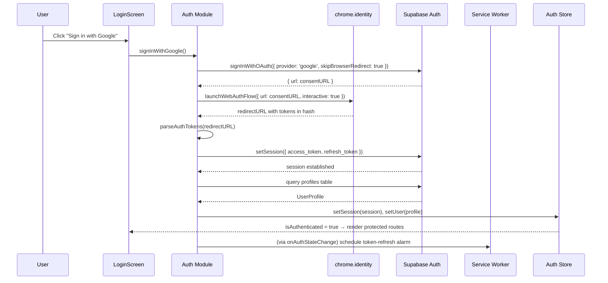
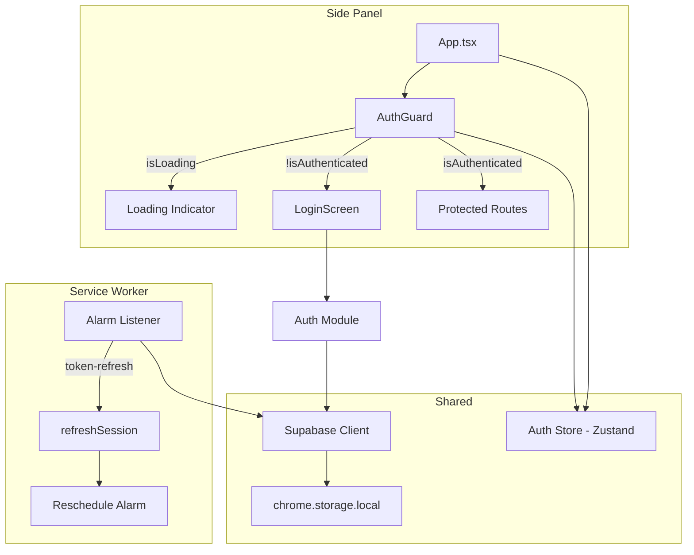

# Design Document — Supabase Auth Integration

## Overview

This design implements Google OAuth authentication for the AutoApply Chrome extension using Supabase Auth with the PKCE flow. The architecture adapts standard OAuth patterns for the Manifest V3 extension context, where `chrome.identity.launchWebAuthFlow` replaces browser redirects and `chrome.storage.local` replaces cookies for session persistence.

The system consists of:
- A token parsing utility that extracts OAuth tokens from redirect URL hash fragments
- An auth module that orchestrates sign-in, session restoration, and sign-out
- A Zustand auth store for reactive UI state
- An AuthGuard component that gates protected routes
- Service worker alarm-based token refresh
- A Supabase `profiles` table with RLS and auto-creation trigger

## Architecture





## Components and Interfaces

### `src/utils/parseAuthTokens.ts` — Token Parser

Pure utility function that extracts tokens from a redirect URL hash fragment.

```typescript
interface ParsedTokens {
  access_token: string;
  refresh_token: string;
}

interface ParseError {
  error: string;
}

type ParseResult = { ok: true; tokens: ParsedTokens } | { ok: false; error: string };

export function parseAuthTokens(redirectUrl: string): ParseResult;
```

### `src/lib/auth.ts` — Auth Module

Orchestrates all authentication operations using the Supabase client singleton.

```typescript
export async function signInWithGoogle(): Promise<{ error?: string }>;
export async function signOut(): Promise<void>;
export async function restoreSession(): Promise<void>;
export async function fetchUserProfile(userId: string): Promise<UserProfile | null>;
```

### `src/stores/authStore.ts` — Auth Store

Zustand store holding reactive auth state.

```typescript
interface AuthStore {
  user: UserProfile | null;
  session: Session | null;
  isLoading: boolean;
  isAuthenticated: boolean;
  setSession: (session: Session | null) => void;
  setUser: (user: UserProfile | null) => void;
  setLoading: (loading: boolean) => void;
  clearAuth: () => void;
}
```

### `src/sidepanel/components/AuthGuard.tsx`

React component that conditionally renders children based on auth state.

```typescript
interface AuthGuardProps {
  children: React.ReactNode;
}

export function AuthGuard({ children }: AuthGuardProps): JSX.Element;
```

Behavior:
- `isLoading === true` → renders loading indicator
- `isAuthenticated === false` → renders `<LoginScreen />`
- `isAuthenticated === true` → renders `children`

### `src/sidepanel/components/LoginScreen.tsx`

Login UI with Google sign-in button, loading state, and error display.

```typescript
export function LoginScreen(): JSX.Element;
```

### `src/background/index.ts` — Service Worker additions

New alarm listener and auth state change handler:

```typescript
// Alarm handler for token refresh
chrome.alarms.onAlarm.addListener((alarm) => { ... });

// Schedule/clear token refresh alarm
function scheduleTokenRefresh(expiresAt: number): void;
function clearTokenRefreshAlarm(): void;
```

## Data Models

### UserProfile (TypeScript)

```typescript
// src/types/auth.ts
export interface UserProfile {
  id: string;
  email: string;
  full_name: string | null;
  avatar_url: string | null;
  onboarding_completed: boolean;
  created_at: string;
  updated_at: string;
}
```

### Profiles Table (Postgres)

```sql
CREATE TABLE public.profiles (
  id UUID REFERENCES auth.users(id) ON DELETE CASCADE PRIMARY KEY,
  email TEXT NOT NULL,
  full_name TEXT,
  avatar_url TEXT,
  onboarding_completed BOOLEAN DEFAULT FALSE,
  created_at TIMESTAMPTZ DEFAULT NOW(),
  updated_at TIMESTAMPTZ DEFAULT NOW()
);
```

RLS Policies:
- SELECT: `auth.uid() = id`
- UPDATE: `auth.uid() = id` with check `auth.uid() = id`
- INSERT: `auth.uid() = id`

Trigger: `on_auth_user_created` → inserts profile row from `auth.users` metadata on signup.

### Auth Store State Shape

```typescript
{
  user: UserProfile | null,
  session: Session | null,       // Supabase Session type
  isLoading: boolean,            // true during session restoration
  isAuthenticated: boolean,      // derived from session !== null
}
```

### chrome.storage.local Keys

| Key | Type | Owner |
|-----|------|-------|
| `sb-<project-ref>-auth-token` | string (JSON) | Supabase chromeStorageAdapter |

The Supabase client manages this key internally via the `chromeStorageAdapter`. Application code should never read/write it directly.


## Correctness Properties

*A property is a characteristic or behavior that should hold true across all valid executions of a system — essentially, a formal statement about what the system should do. Properties serve as the bridge between human-readable specifications and machine-verifiable correctness guarantees.*

### Property 1: Token parsing round-trip

*For any* pair of valid OAuth tokens (access_token, refresh_token), constructing a redirect URL with those tokens in the hash fragment and then parsing it with `parseAuthTokens` SHALL produce an object containing the same access_token and refresh_token values.

**Validates: Requirements 1.3, 8.1, 8.4**

### Property 2: Missing token error identification

*For any* redirect URL hash fragment that contains only one of access_token or refresh_token (but not both), `parseAuthTokens` SHALL return an error result that identifies the specific missing token by name.

**Validates: Requirements 8.2**

### Property 3: AuthGuard rendering correctness

*For any* combination of `isLoading` (boolean) and `isAuthenticated` (boolean) in the Auth Store, the AuthGuard component SHALL render exactly one of: a loading indicator (when isLoading is true), the LoginScreen (when isLoading is false and isAuthenticated is false), or the protected children (when isLoading is false and isAuthenticated is true).

**Validates: Requirements 5.1, 5.2, 5.3**

## Error Handling

| Scenario | Handler | Behavior |
|----------|---------|----------|
| `chrome.identity.launchWebAuthFlow` rejected/cancelled | `signInWithGoogle()` | Returns `{ error: message }`, LoginScreen displays error + retry button |
| `supabase.auth.setSession` fails (invalid tokens) | `signInWithGoogle()` | Clears partial auth state from store, returns error |
| `supabase.auth.refreshSession` fails in service worker | Alarm handler | Clears token-refresh alarm, auth store set to unauthenticated |
| `supabase.auth.signOut` fails | `signOut()` | Still clears local auth store and storage to ensure local logout |
| `supabase.auth.getSession` returns null | `restoreSession()` | Sets `isLoading = false`, AuthGuard renders LoginScreen |
| Profile fetch fails after session set | `restoreSession()` / `signInWithGoogle()` | Session remains valid, user set to null, retry on next navigation |
| `parseAuthTokens` receives URL without hash | Token parser | Returns `{ ok: false, error: "No hash fragment found" }` |
| `parseAuthTokens` receives URL missing a token | Token parser | Returns `{ ok: false, error: "Missing <token_name>" }` |
| Service worker terminates during token refresh | Chrome runtime | Alarm persists; on next wake, alarm fires and refresh retries |

## Testing Strategy

### Unit Tests (Example-Based)

Focus on specific scenarios and integration wiring:

- **Auth Module**: Mock Supabase client and Chrome APIs. Verify `signInWithGoogle()` calls APIs in correct order with correct params. Verify `signOut()` clears store even on API failure. Verify `restoreSession()` handles all three cases (valid session, no session, expired session).
- **AuthGuard**: Render with mocked store states, verify correct component renders.
- **LoginScreen**: Render, verify button exists with ARIA label, verify loading/error states.
- **Service Worker**: Mock `chrome.alarms` API, verify alarm scheduling math and cleanup on sign-out.

### Property-Based Tests

Library: `fast-check` (already compatible with vitest)

Configuration: Minimum 100 iterations per property.

| Property | Test File | Tag |
|----------|-----------|-----|
| Property 1: Token parsing round-trip | `src/utils/__tests__/parseAuthTokens.property.test.ts` | Feature: spec-02-supabase-auth, Property 1: Token parsing round-trip |
| Property 2: Missing token error identification | `src/utils/__tests__/parseAuthTokens.property.test.ts` | Feature: spec-02-supabase-auth, Property 2: Missing token error identification |
| Property 3: AuthGuard rendering correctness | `src/sidepanel/components/__tests__/AuthGuard.property.test.tsx` | Feature: spec-02-supabase-auth, Property 3: AuthGuard rendering correctness |

### Integration Tests

- **Profile trigger**: Create user via Supabase Auth test helper, verify profile row exists with correct fields.
- **RLS policies**: Attempt cross-user profile access, verify denial.
- **End-to-end OAuth flow**: Manual testing with real Google OAuth (cannot be automated in CI due to interactive consent).

### Test Balance

- Property tests cover the token parser exhaustively (pure function, large input space) and AuthGuard state logic.
- Unit tests cover orchestration wiring (correct API calls in correct order) and error handling paths.
- Integration tests verify database triggers and RLS policies against a real Supabase instance.
